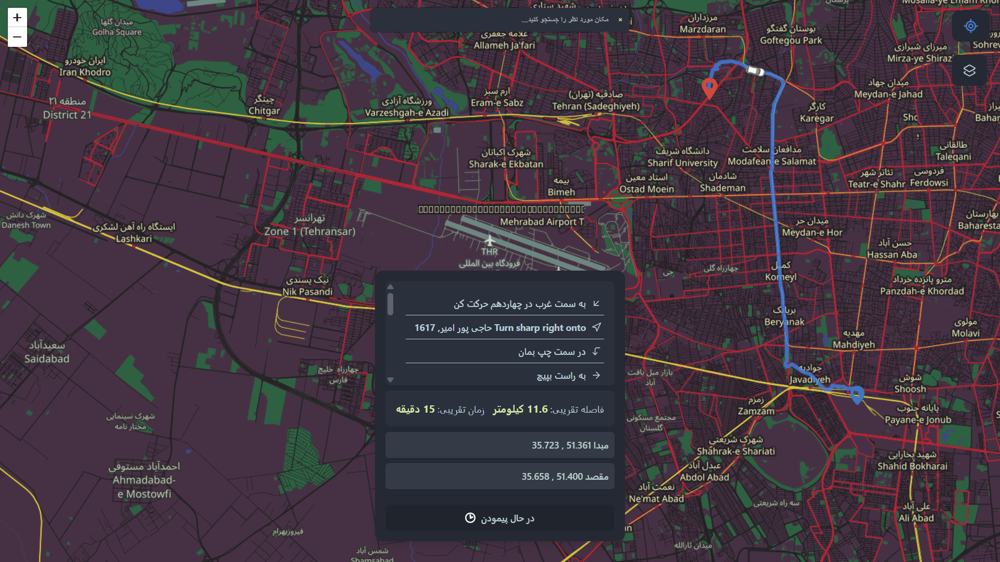
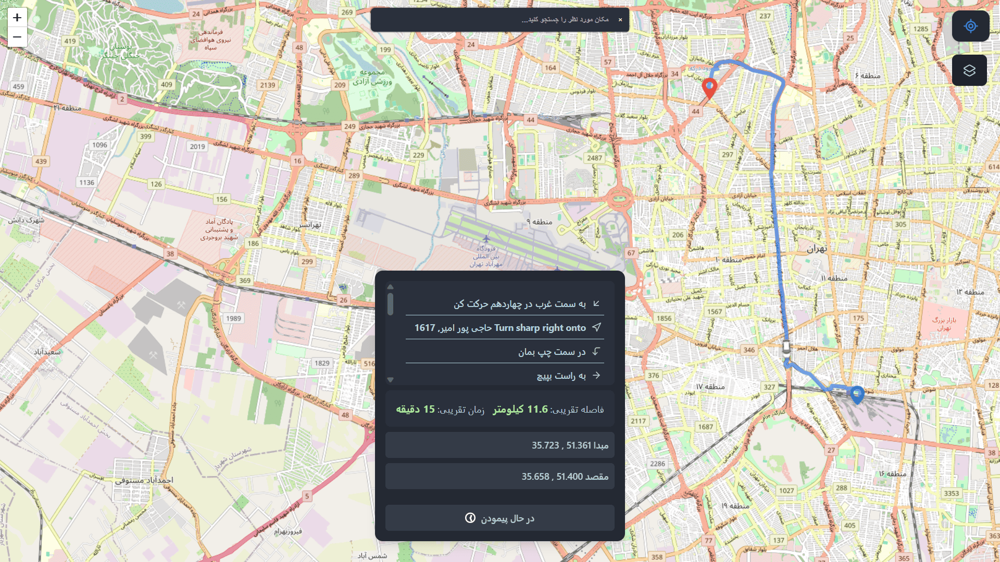
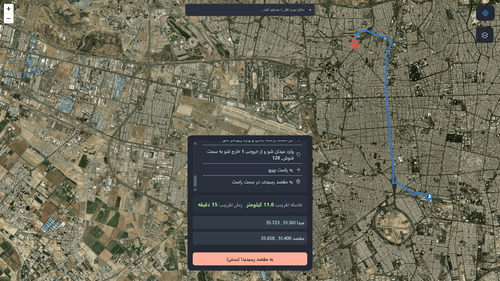

# 🗺️ MapRoute

An interactive mapping application built with React and React Leaflet that provides advanced routing capabilities and location search functionality.

## 🎨 Screenshots

  
  <br/>
  <br/>
  
  <br/>
  <br/>
  

## ✨ Features

- 🔍 **Location Search**: Find places using names or addresses
- 🛣️ **Smart Routing**: Calculate optimal routes between two points
- 📏 **Distance Calculation**: Display accurate route distance
- 📋 **Route List**: Show detailed route instructions
- 🎯 **Point Selection**: Choose origin and destination by clicking on the map
- 📱 **Responsive Design**: Compatible with all devices

## 🚀 Installation & Setup

### Prerequisites

- Node.js (version 14 or higher)
- npm or yarn

### Installation Steps

```bash
# Clone the repository
git clone https://github.com/alirezashn79/router-map.git

# Navigate to project directory
cd router-map

# Install dependencies
npm install

# Start development server
npm start
```

After running the above command, the application will be available at `http://localhost:3000`.

## 🛠️ Technologies Used

- **React**: Main library for building user interface
- **React Leaflet**: React components for interactive maps
- **Leaflet**: Open-source mapping library
- **OpenStreetMap**: Map data source
- **Routing API**: For route calculation

## 📖 How to Use

### 1. Location Search
- Enter a location name or address in the search box
- Select the desired location from the suggestions list

### 2. Routing
- Set the origin point by clicking on the map
- Choose the destination point
- The optimal route will be automatically calculated and displayed

### 3. View Details
- Route distance is displayed at the top of the map
- Detailed route list with turn-by-turn directions is available


## 📝 Code Example

```jsx
import React from 'react';
import { MapContainer, TileLayer, Marker, Popup } from 'react-leaflet';
import 'leaflet/dist/leaflet.css';

function MapComponent() {
  return (
    <MapContainer center={[35.6892, 51.3890]} zoom={13}>
      <TileLayer
        url="https://{s}.tile.openstreetmap.org/{z}/{x}/{y}.png"
        attribution='&copy; OpenStreetMap contributors'
      />
      <Marker position={[35.6892, 51.3890]}>
        <Popup>Tehran, Iran</Popup>
      </Marker>
    </MapContainer>
  );
}
```

## 🔧 Configuration

The application supports the following configurations:

- **API Key**: For commercial routing services (if used)
- **Map Style**: Change map appearance
- **Default Location**: Set default map position

## 🚀 Build for Production

```bash
# Create production build
npm run build

# The build folder will contain the optimized files
```

## 📁 Project Structure

```
router-map/
├── public/
│   ├── index.html
│   └── ...
├── src/
│   ├── components/
│   ├── hooks/
│   ├── utils/
│   ├── App.js
│   └── index.js
├── screenshots/
└── README.md
```

---

⭐ If you found this project useful, please give it a star!
